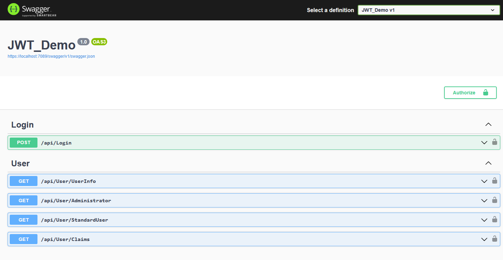
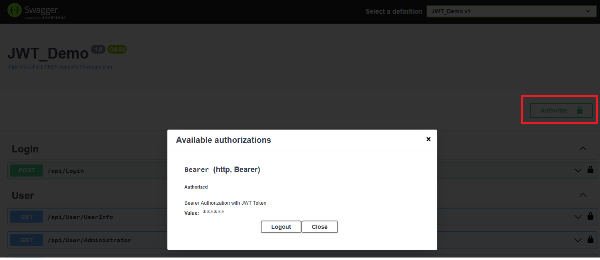
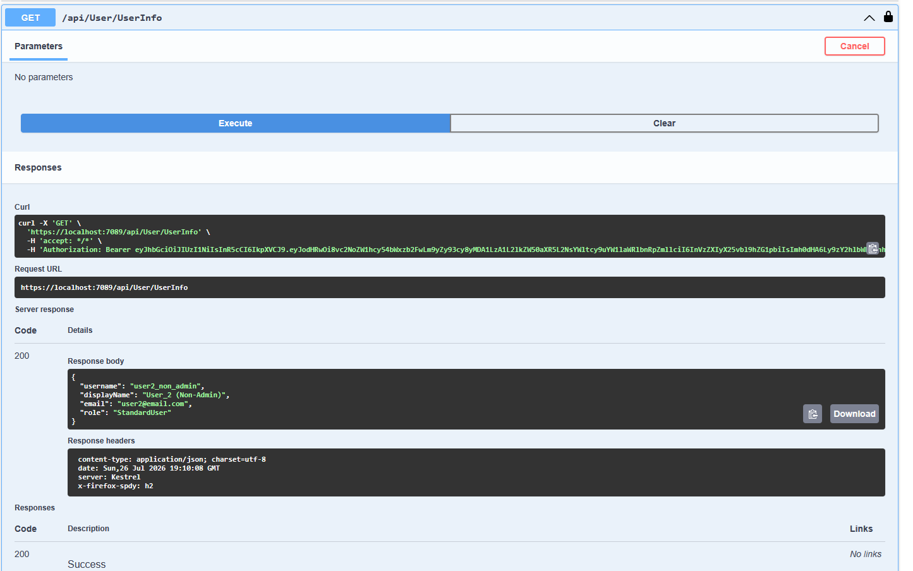
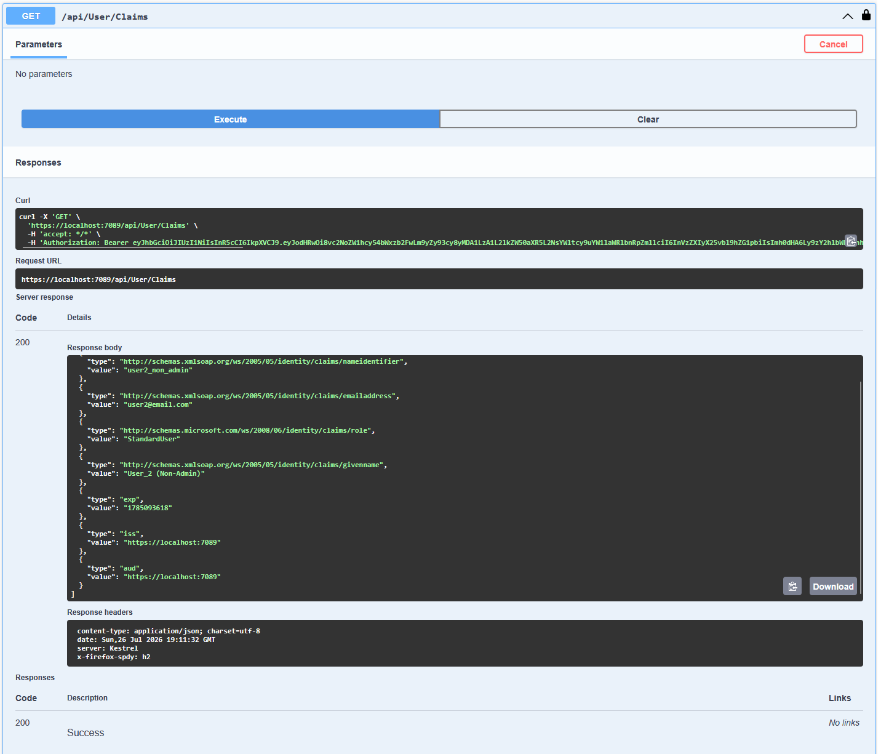

# ASP.NET Core Web API Authentication & Authorization

A secure ASP.NET Core 8 Web API demonstrating JWT Authentication, Claims-Based Authorization, Role-Based Authorization, and Swagger integration using modern API security practices.

This project provides a practical reference implementation for securing REST APIs using JSON Web Tokens (JWT) and demonstrates how authentication and authorization are implemented in ASP.NET Core applications.

---

## 🚧 Project Status

This project is currently under active development.

### ✅ Implemented

- JWT Authentication
- Claims-Based Authorization
- Role-Based Authorization
- ASP.NET Core Web API
- Swagger/OpenAPI Integration
- JWT Bearer Authentication in Swagger
- In-Memory User Store
- Secure API Endpoints

### 🔄 Planned Enhancements

- Refresh Tokens
- ASP.NET Core Identity Integration
- SQL Server Database Support
- User Registration
- Password Hashing
- Policy-Based Authorization
- OAuth 2.0 & OpenID Connect
- Unit & Integration Tests
- Docker Support
- CI/CD using GitHub Actions

---

## 🎯 Project Overview

This project demonstrates how to secure ASP.NET Core Web APIs using JWT (JSON Web Tokens).

It covers the complete authentication flow, token generation, claims-based identity, and role-based authorization while exposing secure REST endpoints that can be tested using Swagger UI.

The implementation follows modern ASP.NET Core development practices and serves as a foundation for building secure enterprise APIs.

---

## 🏗 Architecture Overview

```text
                Client / Swagger UI
                        │
                        ▼
              Login API (/api/Login)
                        │
                        ▼
              JWT Token Generation
                        │
                        ▼
              ASP.NET Core Middleware
                        │
        Authentication + Authorization
                        │
                        ▼
              Protected API Endpoints
```

### Architecture Principles

- Layered API design
- Dependency Injection
- JWT Bearer Authentication
- Claims-Based Identity
- Role-Based Authorization
- Configuration-driven security
- RESTful API design

---

## 🔐 Authentication Flow

```text
User Login
     │
     ▼
Validate Credentials
     │
     ▼
Generate JWT Token
     │
     ▼
Return Token to Client
     │
     ▼
Client sends Bearer Token
     │
     ▼
Token Validation Middleware
     │
     ▼
Protected API Access
```

---

## 📸 API Preview

### Swagger UI



### JWT Authentication



### Protected Endpoint





---

## 🛠 Technology Stack

### Backend

- C#
- ASP.NET Core 8
- ASP.NET Core Web API
- JWT Bearer Authentication
- Dependency Injection

### Security

- JSON Web Token (JWT)
- Claims-Based Authentication
- Role-Based Authorization
- HMAC SHA256 Token Signing

### API Documentation

- Swagger / OpenAPI

### Data Store

- In-Memory User Store (Demo Implementation)

---

## ✨ Implemented Features

### 🔑 Authentication

- User Login
- JWT Token Generation
- Token Expiration
- Secure Token Signing

### 👤 Authorization

- Protected Endpoints
- Claims Extraction
- Role-Based Endpoint Protection
- Current User Information

### 📄 API Documentation

- Interactive Swagger UI
- JWT Authentication Support in Swagger

---

## 📡 Available API Endpoints

| Endpoint | Method | Authorization |
|----------|--------|---------------|
| `/api/Login` | POST | Anonymous |
| `/api/User/UserInfo` | GET | Authenticated User |
| `/api/User/Administrator` | GET | Administrator |
| `/api/User/StandardUser` | GET | StandardUser |
| `/api/User/Claims` | GET | Authenticated User |

---

## 🔑 JWT Claims Included

The generated JWT contains the following claims:

- Username
- Email
- Display Name
- User Role

These claims are used to authorize requests and identify the authenticated user throughout the application.

---

## 🚀 Running the Application

1. Clone the repository
2. Open the solution in Visual Studio 2022 or later
3. Build and run the application
4. Open Swagger UI
5. Call the Login endpoint
6. Copy the generated JWT
7. Click **Authorize** in Swagger
8. Enter:

```
Bearer <your-jwt-token>
```

9. Access the protected endpoints

---

## 📂 Project Structure

```text
Controllers/
    LoginController
    UserController

Models/
    UserModel
    UserLogin
    UserConstants

Program.cs

appsettings.json
```

---

## 🔮 Future Enhancements

- Refresh Token support
- SQL Server integration
- ASP.NET Core Identity
- Password hashing
- Policy-Based Authorization
- OAuth 2.0
- OpenID Connect
- Azure AD / Microsoft Entra ID integration
- Docker containerization
- GitHub Actions CI/CD
- Unit Testing
- Integration Testing

---

## 👨‍💻 Author

**Raj Kumar Arora**

Associate Architect | Lead Full Stack Engineer

**Tech Stack:** C#, .NET, ASP.NET Core, Azure, Angular, SQL, Microservices, AI, Cloud Architecture

GitHub: https://github.com/Raj-Kumar-Arora
